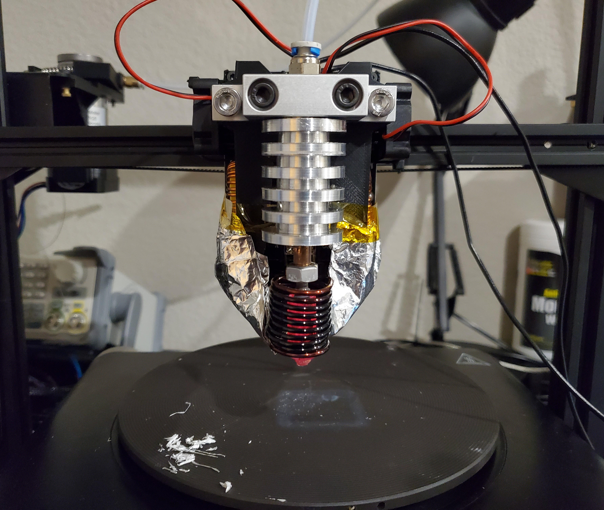
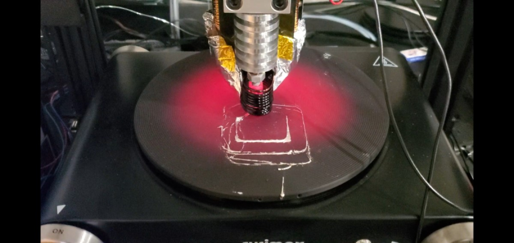
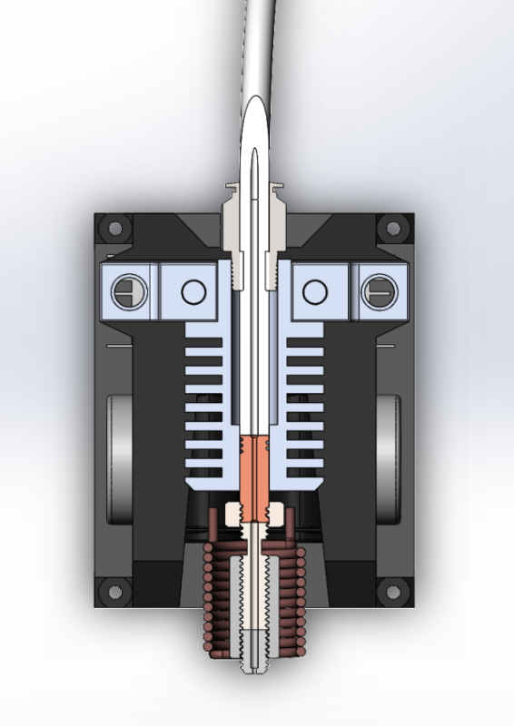

# Induction 3D Metal Printer
A 3d printer nozzle assembly capable of FDM printing aluminum using induction heating. Total materials cost for nozzle assembly is only ~100$.

This was designed as a mod that can be retrofitted onto an existing FDM printer chassis, in this case an old CR-10. 
