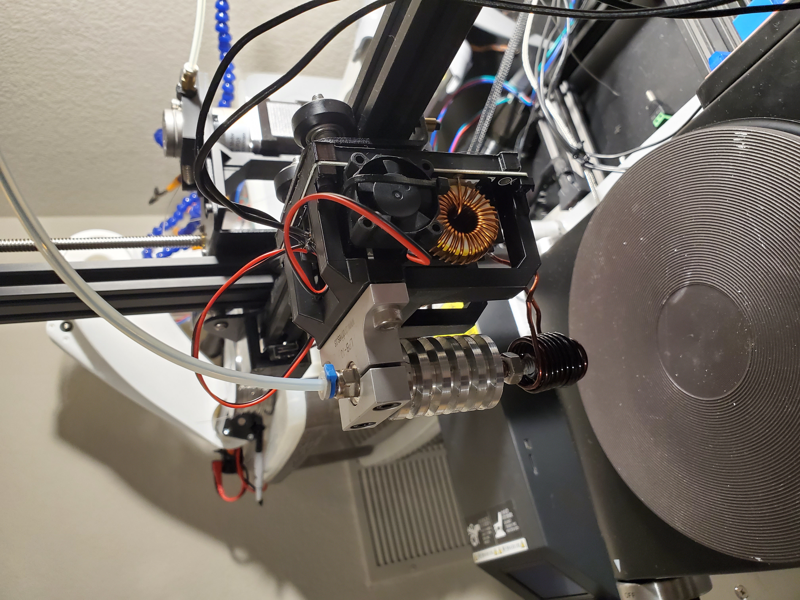

# Induction 3D Metal Printer
A 3d printer nozzle assembly capable of FDM printing aluminum using induction heating. Total materials cost for nozzle assembly is only ~100$. This is designed to be retrofitted onto an existing printer for testing/ experimentation.

